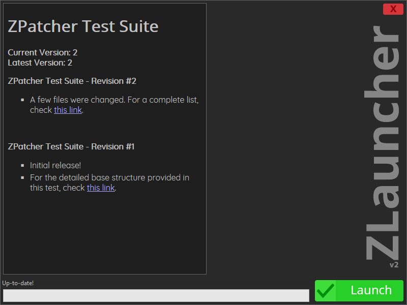

🩹 ZPatcher Lib
================

The ZPatcher library provides a set of utilities to easily update applications
and games using patch files.

It compares the contents of two different versions of the target software and
creates a file with all the changes between these two versions. This file can
be then distributed to users to update their copy of the software without
needing to redownload the entire package.

An experienced developer can also add support to seamless update their software
by adding the library to it.

💻 ZPatcher Suite
------------------

This repository also inclues a fully featured standalone implementation for the
ZPatcher lib!

Features:
* Multiplatform, currently supporting Windows, OSX and Linux.
* Open Source
* Easy to Create patch files for your game/application
* Skinnable
* Command line tools available to be easily included in deployment scripts
* Client-Side automatic Download-and-Apply patching process
* File backup when applying a patch, reducing the chances of a broken build on clients
* (Launcher Only) Display the Change Log for your patches

🚀 ZLauncher quick start guide: [ZLauncherQuickStartGuide.md][9]
📖 ZPatcher Suite user guide: [ZPatcherSuiteApplications.md][8]

⚙️ Compiling
-------------

The application can be compiled in Windows, macOS and Linux with a few simple
steps. Check [Compiling.md][7] for instructions on how to compile the for your
target platform.

🖋️ Future features
-------------------

While the application is stable and mature, there is always room from
improvement. A few features are planned, but not yet implemented:

- Add hash check of the files to be updated by a patch.
- Add support for binary file deltas. Currently considering using
  [minibsdiff][6], but suggestions are welcome.
- Patch merger (i.e. Given two incremental patch files, merge them in a single
  patch file).

Please note these features are not listed in order of priority. Also, there
isn't a timeframe for those features to be added.

Pull requests are very much welcome!

📑 Third Party libraries
-------------------------

ZPatcher uses a few external libraries to aid in it's functions:

- [libcurl][1]
- [LZMA SDK 21.07][2] provides the LZMA2 compression algorithm.
- [Dirent interface for Windows][3] for directory navigation under Windows
- [RapidXML][4] for XML parsing
- [MD5][5] implementation by L. Peter Deutsch

CreatePatch and ApplyPatch uses ZPatcherLib, which uses [LZMA SDK][2] and
[Dirent][3].

ZUpdater also uses [libcurl][1] and [RapidXML][4].

📌 Final Considerations
------------------------

It is my desire to keep this project as a cross-platform lib and application.
If you attempting to compile it for a new platform and run into issues and/or
have a fix for it, please, don't hesitate to open a new Issue or Pull Request!

Contributions to the project are welcome!
Get in touch if you want to contribute and be sure to send pull requests!

Last but not least, I'm not sure how to properly give credit to libraries used
in this project. If it's done in a wrong way, I'd certainly appreciate some
help on how to format and give credit in an appropriate way. :)

[1]: https://curl.haxx.se/libcurl/
[2]: http://www.7-zip.org/sdk.html
[3]: https://github.com/tronkko/dirent
[4]: http://rapidxml.sourceforge.net/
[5]: https://sourceforge.net/projects/libmd5-rfc/files/
[6]: https://github.com/thoughtpolice/minibsdiff
[7]: docs/Compiling.md
[8]: docs/ZPatcherSuiteApplications.md
[9]: docs/ZLauncherQuickStartGuide.md
